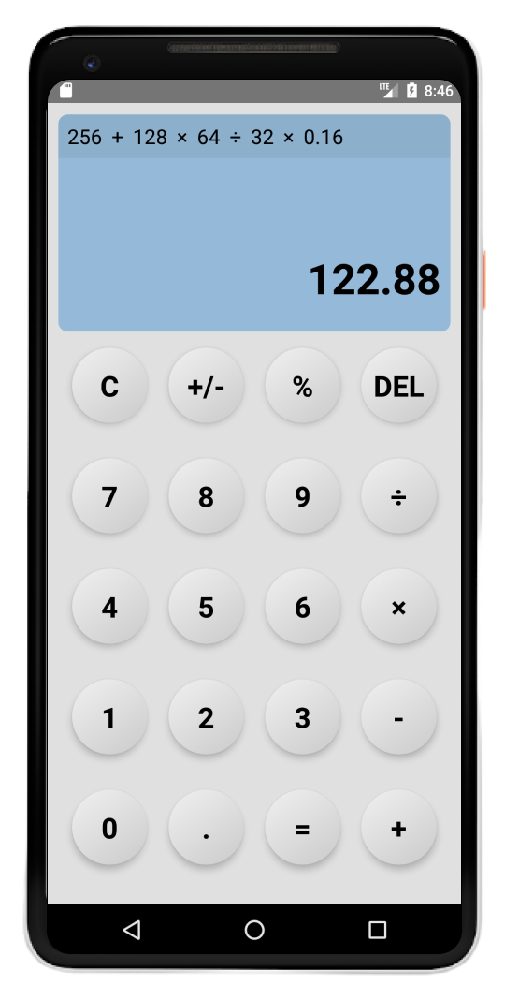

    
  <h1>Mobile Calculator</h1>

  

    Mobile Calculator is a mobile application that allows you to perform basic arithmetic operations, keep a history for each operation with the initial value and also obtain percentages.
  

  <h2>Demo</h2>

   

## Table of Contents

- [Steps to Collaborate](#steps-to-collaborate)
- [License](#license)

## Steps to Collaborate

1. Fork the project: by clicking the fork button (located at the top right corner)
2. Clone the project: `git clone https://github.com/<your username>/Mobile-App-Calculator`
3. Install dependencies: `npm install` or use `npm i`
4. Run the project: `npm run android`
5. Do the necessary improvements and make a commit: `git commit -am "<commit message>"` or use `git add .` and then `git commit -m "<commit message>"`
6. Upload changes to the repository created with the fork: `git push origin <branch name>`
7. Create a pull request to the original project.

## License

[MIT License](https://github.com/Ulzahk/Mobile-App-Calculator/blob/dev/LICENSE)
